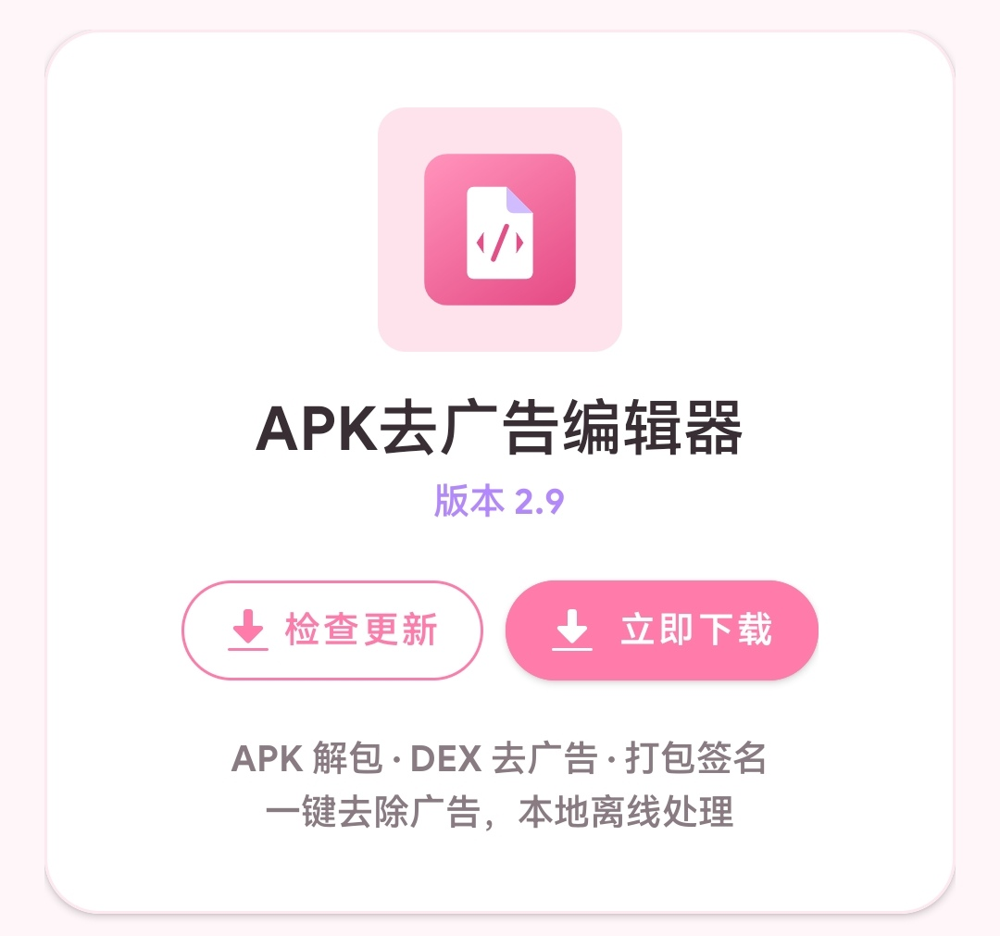

<div align="center">

# APK去广告编辑器（ApkAdRemoverEditor）

**一款面向逆向爱好者的专业级 APK 去广告工具**

基于 dexlib2 构建 · 字节码直接修补 · 数据复用优化 · 全自动流水线

<br>


</div>

---

## 📖 项目简介

一键完成 **解包 → 去广告 → 体积优化 → 打包 → 签名** 全流程，全程本地离线处理，无需网络。

摒弃传统 smali 反汇编-回汇编流程，采用**字节码直接修补**方案，在保证处理精度的同时将处理速度提升数倍。

## ✨ 功能特性

### 🛡 去广告核心

- **18 类广告特征全覆盖**：SDK 库 / 权限 / 类 / 方法 / 资源 / URL / View / Activity / Service / Receiver，可自定义增删改查与一键重置
- **AXML 深度处理**：移除广告组件、广告权限声明、隐藏 Res 布局广告 View
- **方法级精准处理**：广告类方法置空、广告链接置空、View 几何置空
- **会员功能解锁**：强制返回 true/false，解密会员功能并屏蔽广告判定
- **广告资源清理**：自动清理广告 SDK 原生库 (.so)、assets 广告资源与根目录广告文件
- **Flutter 应用适配**：解析 Dart AOT 快照，抹除 libapp.so 中的广告字符串特征

### 📦 体积优化

- **数据复用优化**：过签包（如 LSPatch 产物）复用原包数据段，最多减小约 50% 体积
- **重命名识别**：原包被重命名为无后缀或任意后缀也能准确识别并优化
- **DEX 体积优化**：移除调试信息（行号/局部变量表），再减小 5%~15% 体积
- **智能压缩策略 + ZIP 对齐**：保证打包后 APK 正常安装启动

### 🔒 稳定性与安全

- **v1 + v2 双签名**，兼容低版本设备，处理结果可直接安装
- **DEX 崩溃防护**：备份保护 + 原子写入 + 异常自动恢复
- **路径穿越防护**：修复 Zip Slip 漏洞，杜绝恶意 APK 越界写文件
- **低内存扫描**：超大 DEX 也能稳定处理不卡死

### 🎨 使用体验

- 实时彩色处理日志，支持一键复制 / 清空
- 自动生成 Markdown 处理报告
- 广告特征订阅导入与分享
- 明暗双主题（跟随系统 / 白天 / 夜间）

## 📸 界面预览

<table>
  <tr>
    <td align="center" width="50%">
      <b>主界面 · 一键处理</b><br>
      
    </td>
    <td align="center" width="50%">
      <b>关于 · 版本信息</b><br>
      
    </td>
  </tr>
</table>

## 🚀 快速上手

### 编译

```bash
# 环境要求：Android Studio / JDK 17+ / SDK 34
./gradlew assembleRelease
```

产物位于 `app/build/outputs/apk/release/`，可直接安装使用。

### 使用

1. 选择需要处理的 APK 文件（支持重命名后的 APK）
2. 点击"开始处理"，自动完成解包、去广告、体积优化、打包、签名
3. 处理完成自动导出到原包目录，并生成 Markdown 处理报告

## 🏗 技术架构

| 模块 | 技术方案 | 核心说明 |
|------|----------|----------|
| DEX 修补引擎 | dexlib2 2.5.2 | 直接修改字节码，无需反汇编/回汇编 |
| AXML 处理器 | 自研解析器 | 解析 AXML chunk 结构，移除广告组件与权限 |
| 数据复用优化 | ApkDataMultiplexing | 中央目录偏移复用原包数据段 |
| 签名模块 | apksig + V2V3SchemeSigner | v1/v2 双签名，优化后专用签名 |
| Flutter 适配 | Dart AOT 快照解析 | 抹除 libapp.so 广告字符串特征 |
| 打包模块 | 自研 ZIP 引擎 | 智能压缩 + 对齐 + 崩溃防护 |

## ⚖️ 开源致谢

本应用基于以下开源项目构建，在此向作者表示诚挚感谢：

| 项目 | 作者/组织 | 用途 | 协议 |
|------|-----------|------|------|
| [ApkDataMultiplexing](https://github.com/L-JINBIN/ApkDataMultiplexing) | L-JINBIN | 数据复用优化核心算法 | 未标注 |
| [dexlib2 / smali](https://github.com/JesusFreke/smali) | JesusFreke | DEX 文件读写与 smali 工具链 | BSD 3-Clause |
| [apksig](https://android.googlesource.com/platform/tools/apksig) | AOSP | APK 签名实现 | Apache 2.0 |
| [BouncyCastle](https://www.bouncycastle.org/) | bcprov/bcpkix | 加解密与证书生成 | MIT |
| [Guava](https://github.com/google/guava) | Google | 集合与工具库 | Apache 2.0 |
| [AndroidX](https://developer.android.com/jetpack) | AOSP | Jetpack 支持库 | Apache 2.0 |
| [Material Components](https://github.com/material-components/material-components-android) | Google | Material 组件 | Apache 2.0 |
| [DTL-X](https://github.com/Gameye98/DTL-X) | Gameye98 | 广告特征规则参考 | 仅供学习 |

详细的开源项目与参考代码出处，请参阅 [`开源声明.md`](开源声明.md)。

## 📄 许可证

本项目基于 [MIT License](LICENSE) 开源。

> ⚠️ 本工具仅供学习、研究与个人合法用途使用。请勿对您不拥有版权、未获授权或受法律保护的应用进行修改与分发，由此产生的法律责任由使用者自担。